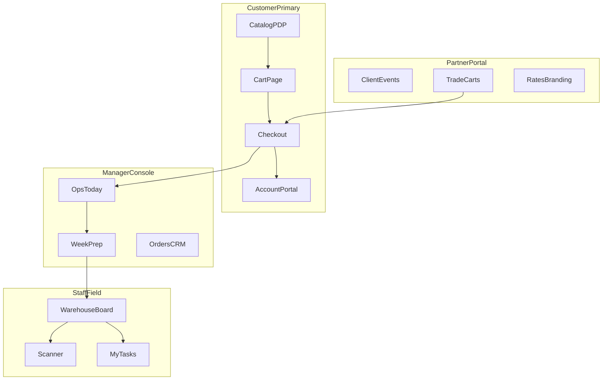

# PrimeLux Self-Service UX Rehaul

Source of truth for a **full-product design + UX rehaul**. Goal: a premium, informative, low-bloat self-service platform where each role has one clear job.

**Design baseline (locked):** dark luxury — ink / surface / champagne in [`app/globals.css`](app/globals.css). Rehaul = information architecture, density, and flows — not a new palette.

---

## Roles (customer first)

| Priority | Role | Job to be done | Success looks like |
|----------|------|----------------|--------------------|
| **P0** | **Customer** | Discover pieces, build a rental, pay, track delivery/pickup **without calling** | Completes browse → cart → checkout → portal alone; knows status at every step |
| P1 | Manager | Oversee weekend readiness Mon–Thu; intervene on exceptions only | Lives in Ops Today → Week Prep; rarely digs into tool sprawl |
| P1 | Staff | Execute pick / pack / load / deliver | Field shell: My Tasks / Scan / Loads — not full admin |
| P2 | Partner (planner/venue) | Book for clients at trade rates; share carts | One-job portal: events/carts → rates/branding secondary |

### Customer north-star journey

```text
Discover (catalog/packages)
  → Decide (PDP specs + availability + delivery clarity)
  → Assemble (cart page + optional add-ons)
  → Reserve (checkout: event → sign → pay)
  → Track (account: timeline, docs, balance, support)
```

Every other role exists to **fulfill and support that journey** without becoming the product’s center of gravity.

**Manager / staff / partner north stars**
- Partners: book for clients at trade rates with shared carts / events
- Managers: oversee weekend readiness Mon–Thu; intervene only on exceptions
- Staff: pick / pack / load / deliver via a focused field shell

---

## Principles (non-negotiable)

1. **Customer clarity first** — if a screen doesn’t help a renter decide, book, or track, it is secondary
2. **One job per screen** — no tool dumps; progressive disclosure
3. **Self-serve first** — phone/email is escalation, not the happy path
4. **Week Prep is the manager spine** — everything else feeds Fri–Sun readiness ([`ADMIN.md`](ADMIN.md))
5. **Role shells** — Customer store, Partner portal, Manager console, Staff field app share tokens but different chrome/nav
6. **Premium without bloat** — cut redundant nav, duplicate CTAs, and secondary tools behind search (`⌘K`)



---

## Master TODO checklist

### Plan & foundations
- [x] Write this document (`SELF_SERVICE_UX_REHAUL.md`)
- [x] Document lux primitives (page title, `.lux-label`, CTA, empty state, status chip, table density) — in `app/globals.css` + this doc

### Phase A — Shells
- [x] Unify Store / Account / Manager / Staff shells on dark luxury tokens (account layout + portal home)
- [x] Account portal: dark surface panels only (no light leftovers on home)
- [x] Staff: condensed nav — hide Catalog/Manage/Analytics by default (`filterNavGroupsForStaff`)

### Phase B — Customer store & checkout (PRIORITY BUILD)
- [x] Catalog first screen = filters + grid (short hero); featured secondary
- [ ] PDP: availability for event date, delivery notes, specs; one primary “Add to rental”
- [ ] Packages: what’s included + guest-count guidance
- [x] First-class `/cart` page (keep sheet as shortcut)
- [x] Checkout inline help: lead time, CT/RI/MA service area, deposit meaning
- [ ] Split checkout into step components; sticky order summary
- [x] Account home = next upcoming order + pay / message actions
- [ ] Order detail = status timeline + invoice/agreement + support CTA
- [ ] Favorites → “Build rental from favorites”

### Phase C — Partner portal
- [ ] Partner home: one metric + one primary CTA
- [ ] Public `/partners/apply`
- [ ] Event/cart-centric list UX
- [ ] “Trade rate applied” chip at checkout
- [ ] Admin partner approve → tier → attributed orders queue

### Phase D — Manager console
- [ ] Ops Today = exceptions-only attention queue + weekend readiness strip
- [ ] Week Prep = primary manager canvas (Fri–Sun × Pick/Pack/Bags/Load)
- [ ] Nav collapse: Today | Pipeline | Fulfillment | Catalog | Manage
- [ ] CRM deep links: lead → customer → order
- [ ] Settings = business profile + Stripe status

### Phase E — Staff field
- [x] Staff default condensed nav + mobile Tasks / Scan / Loads / More
- [ ] Staff default landing: warehouse schedule or tasks
- [ ] Task cards: large targets, one primary action
- [ ] Scanner order-context banner from Week Prep `?orderId=`
- [ ] Clear “needs connection” on offline mutations

### Phase F — Cross-cutting
- [ ] Shared status vocabulary/chips across customer / partner / admin / staff
- [ ] Microcopy audit (rental logistics, not planning-firm voice)
- [ ] Motion budget + `prefers-reduced-motion`
- [ ] A11y pass on lux CTAs and icon buttons
- [ ] Checkout code-split / perf

---

## Phase A — Design system & shells

| Shell | Who | Chrome | Key files |
|-------|-----|--------|-----------|
| Store | **Customers** (primary) | Header + footer, lux CTAs | `components/site-header.tsx`, `components/hero-section.tsx` |
| Account | Customers + partners | Slim portal nav | `components/account-sidebar.tsx`, `app/account/layout.tsx` |
| Manager | Admin/manager | Ops-first sidebar | `lib/admin/nav.ts`, `components/admin/page-shell.tsx` |
| Staff | Warehouse/field | Mobile bottom: Tasks / Scan / Schedule / Menu | Role-aware layout under `/admin` |

**Concrete design changes**
- Primitives: page title, `.lux-label`, primary/ghost CTA, empty state, status chip, row density
- Staff: hide Catalog/Manage/Analytics by default
- Global empty/error patterns aligned with `app/not-found.tsx` / `app/error.tsx`

---

## Phase B — Customer store & checkout (self-serve rent)

The **centerpiece** of the rehaul. Customers must feel informed and confident at every step.

### Informative by default
- Service area, lead time, and deposit rules visible near decision points (catalog banner, cart, checkout) — not buried in FAQ only
- Pricing transparency: line items, delivery estimate path, deposit vs balance
- Empty states that teach the next action (“Browse seating”, “Add event date”)

### Store
- Catalog first screen = filters + grid ([`app/catalog/catalog-client.tsx`](app/catalog/catalog-client.tsx)); shorten hero
- PDP: availability for selected event date, delivery notes, specs — one primary “Add to rental”
- Packages: clear “what’s included” + guest-count guidance
- First-class `/cart` page (sheet remains a shortcut)

### Checkout ([`app/checkout/page.tsx`](app/checkout/page.tsx))
- Steps: Add-ons → Event/Delivery → Review & Pay
- Extract step components; **sticky summary** always visible
- Inline help: lead time, CT/RI/MA, what deposit covers
- Post-pay: order timeline in account

### Account (customer portal)
- Home = **next upcoming order** + actions (pay balance, message, reschedule request)
- Order detail = status timeline + documents + support CTA
- Favorites → “Build rental from favorites”
- Messaging framed as “Help with this order” not generic inbox

---

## Phase C — Partner / planner / venue portal

Preferred Partner Portal (not marketplace). Builds on `/account/partner/*` and [`PREFERRED_VENDOR_PORTAL_PLAN.md`](PREFERRED_VENDOR_PORTAL_PLAN.md).

1. Active client events / shared carts  
2. Start new cart for a client  
3. Rates & branding (secondary)

Public `/partners/apply`; trade-rate chip at checkout; admin approve → tier → attributed orders.

**Out of scope:** perks marketplace, commissions, multi-vendor directory

---

## Phase D — Manager console

Managers live in **Ops Today → Week Prep** Mon–Thu.

- Ops Today: exceptions only + weekend readiness counts
- Week Prep: Fri–Sun × Pick/Pack/Bags/Load; generate missing tasks; exception filters
- Nav surgery in `lib/admin/nav.ts`; rare tools in `⌘K`
- CRM deep links so Pipeline isn’t siloed

---

## Phase E — Staff field shell

- Default landing: `/admin/warehouse/schedule` or `/admin/tasks`
- Mobile: **My Tasks / Scan / Today’s loads / More**
- Large task cards; scanner order-context from Week Prep
- Honest offline messaging (no fake offline writes yet)

---

## Phase F — Cross-cutting

Shared status chips/copy; rental microcopy; motion budget; a11y; checkout split perf.

---

## Explicit non-goals

- Innovate studios redesign
- Delivery route-optimize APIs
- Full CSP/Sentry (ops follow-up)
- Partner Phase 2+ perks/reporting beyond event carts + rates
- Turning admin into a generic BI dashboard

---

## Sequencing

1. This doc + lux primitive notes  
2. Phase A shells  
3. **Phase B customer path (highest priority)**  
4. Phase D Week Prep / Ops  
5. Phase E staff field  
6. Phase C partner IA  
7. Phase F polish  

Branch: `cursor/self-service-ux-rehaul-3635`
